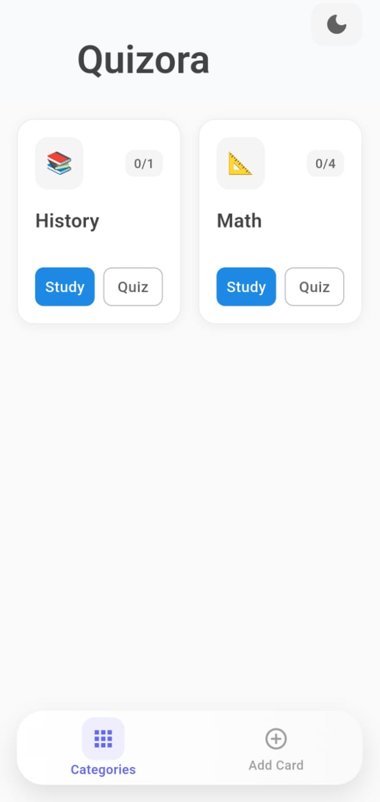
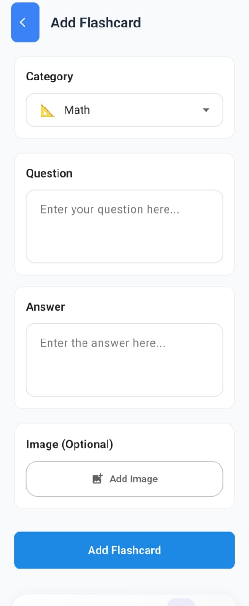
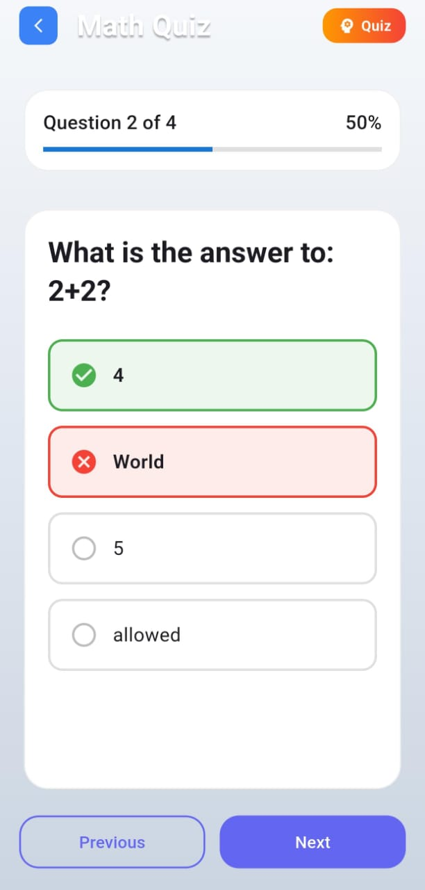
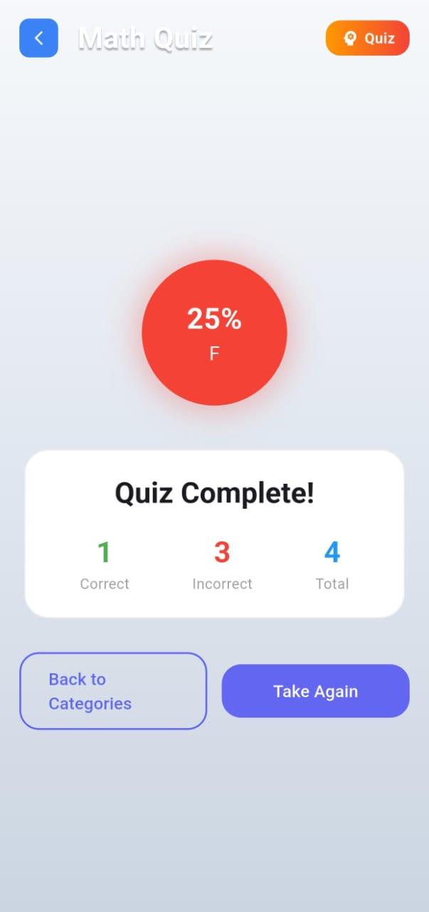

# 📚 Quizora - AI-Powered Flashcards Learning App

<div align="center">


**A comprehensive Flutter-based flashcards application with AI-powered quiz generation**  
_Built for the GDG VITC App Development Recruitment Assignment_

</div>

---

## 🎯 App Idea & Overview

**Quizora** is an innovative learning companion that transforms traditional flashcard studying into an interactive, AI-enhanced experience. The app combines the proven effectiveness of spaced repetition with modern technology to create an engaging educational tool.

### 💡 **Core Concept**

- **Smart Learning**: AI-generated quiz questions that test understanding, not just memorization
- **Progress Tracking**: Visual progress indicators and learning analytics
- **Offline-First**: Works seamlessly without internet connection
- **Cross-Platform**: Native performance on all devices

### 🎯 **Target Users**

- Students preparing for exams and tests
- Language learners building vocabulary
- Professionals acquiring new skills
- Anyone looking to memorize information effectively

---

## ✨ Features Implemented

### 📚 **Level 1: Basic Flashcards** ✅

- ✅ **Create Flashcards**: Intuitive form to add questions and answers
- ✅ **View All Cards**: Browse through your flashcard collection
- ✅ **Interactive Flipping**: Tap to reveal answers with smooth 3D animations
- ✅ **Clean UI**: Modern, distraction-free interface design

### 🚀 **Level 2: Navigation & Progress** ✅

- ✅ **Smart Navigation**: Next/Previous buttons with swipe gestures
- ✅ **Progress Tracking**: Real-time progress bar showing "Card 3 of 10"
- ✅ **Image Support**: Add pictures to flashcards for visual learning
- ✅ **Mark as Learned**: Remove mastered cards from study sessions

### 🗂️ **Level 3: Categories & Persistence** ✅

- ✅ **Category System**: Organize cards into Math, Science, History, Geography, Language, Art
- ✅ **Category-based Study**: Focus on specific subjects
- ✅ **SQLite Database**: Persistent local storage for all data
- ✅ **Dark Mode**: Complete theme system with user preferences

### 🤖 **Bonus: AI-Powered Quiz Mode** ✅

- ✅ **Google Gemini Integration**: AI-generated multiple-choice questions
- ✅ **Smart Question Generation**: Context-aware questions that test comprehension
- ✅ **Scoring System**: Complete grading with percentages (A+, A, B, C, F)
- ✅ **Fallback System**: Works offline with intelligent question generation
- ✅ **Performance Analytics**: Detailed quiz results and insights

### 🎨 **Enhanced User Experience**

- ✅ **Animated Transitions**: Smooth 3D card flips and screen transitions
- ✅ **Responsive Design**: Adapts to different screen sizes
- ✅ **Image Gallery**: Pick photos from device gallery
- ✅ **Visual Progress**: Linear progress indicators throughout the app

---

## 🛠️ Tech Stack & Libraries

### **Core Framework**

```yaml
Flutter: ^3.9.0 # Cross-platform UI framework
Dart: ^3.9.0 # Programming language
```

### **State Management**

```yaml
provider: ^6.1.1 # Reactive state management
```

### **Database & Storage**

```yaml
sqflite: ^2.3.0 # Local SQLite database
shared_preferences: ^2.2.2 # Key-value storage for settings
path: ^1.8.3 # File path utilities
```

### **UI & Media**

```yaml
cupertino_icons: ^1.0.8 # iOS-style icons
image_picker: ^1.0.4 # Camera and gallery access
```

### **AI Integration**

```yaml
http: ^1.5.0 # REST API communication
flutter_dotenv: ^6.0.0 # Environment variables
```

### **Development & Testing**

```yaml
flutter_test: sdk: flutter          # Widget testing
flutter_lints: ^5.0.0              # Code quality
sqflite_common_ffi: ^2.3.6         # Database testing
```

---

## 📱 App Screenshots

### 🏠 **1. Home Screen & Navigation**



### 📖 **2. Study Session**


### ➕ **3. Add New Flashcard**



### 🧠 **4. AI Quiz Mode - Question**



### 🏆 **5. Quiz Results**


---

## � Steps to Run the Project

### **Prerequisites**

Before you begin, ensure you have the following installed:

- **Flutter SDK** (version 3.9.0 or higher)
  ```bash
  flutter --version
  ```
- **Android Studio** or **VS Code** with Flutter extensions
- **Android/iOS device** or emulator for testing

### **Step-by-Step Installation**

#### **1. 📥 Clone the Repository**

```bash
git clone https://github.com/Arhaan-P/quizora
cd quizora
```

#### **2. 📦 Install Dependencies**

```bash
flutter pub get
```

#### **3. 🔑 Configure Gemini AI (Optional)**

The app works perfectly without an API key using smart fallback questions, but for enhanced AI-generated quizzes:

1. Get your free API key from [Google AI Studio](https://makersuite.google.com/app/apikey)
2. Open the `.env` file in the project root
3. Replace the placeholder with your actual API key:
   ```env
   GEMINI_API_KEY=your_actual_api_key_here
   ```

#### **4. ▶️ Run the Application**

```bash
# For debug mode
flutter run

# For specific platform
flutter run -d android
flutter run -d ios
flutter run -d chrome  # for web
```

#### **5. 🧪 Run Tests (Optional)**

```bash
# Run all tests
flutter test

# Run with coverage
flutter test --coverage
```

#### **6. 🏗️ Build for Production**

```bash
# Android APK
flutter build apk --release

# iOS (requires Mac)
flutter build ios --release

# Web
flutter build web --release
```

---

## 💡 Key Technical Implementation

### **🗄️ Database Schema**

```sql
CREATE TABLE flashcards(
  id INTEGER PRIMARY KEY AUTOINCREMENT,
  question TEXT NOT NULL,
  answer TEXT NOT NULL,
  imagePath TEXT,
  category TEXT NOT NULL,
  isLearned INTEGER NOT NULL DEFAULT 0,
  createdAt TEXT NOT NULL
);
```

### **🤖 AI Integration**

- **Primary**: Google Gemini API for intelligent question generation
- **Fallback**: Smart local algorithm using existing flashcard content
- **Error Handling**: Graceful degradation when API is unavailable

### **🎨 Design System**

- **Material Design 3** with custom color schemes
- **Responsive layouts** adapting to screen sizes
- **Smooth animations** using Flutter's animation framework
- **Accessibility** features for inclusive design

---
### **🌙 Theme System**

- Light and dark modes
- Persistent user preferences
- Smooth theme transitions
- System theme integration

---

## 🚀 Performance Optimizations

- **Lazy Loading**: Efficient data loading for large datasets
- **Database Indexing**: Optimized queries for fast retrieval
- **Image Optimization**: Compressed image storage and caching
- **Memory Management**: Proper disposal of resources and controllers

---

## 🧪 Testing Strategy

- **Widget Tests**: UI component testing
- **Unit Tests**: Business logic verification
- **Integration Tests**: End-to-end user flows
- **Database Tests**: SQLite operations validation

---
## 🤝 Contributing

This project was developed as part of the GDG VITC App Development Recruitment Assignment. 
---

## 📄 License

This project is developed for educational purposes as part of the GDG VITC recruitment process.

---

<div align="center">

**Built with ❤️ using Flutter**

_September 2025 • GDG VITC App Development Recruitment Assignment_

</div>
